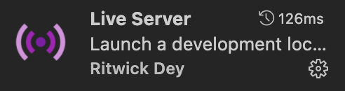
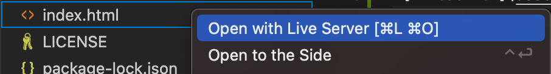

### Functional Programming

# Survey data cleaning

Here you can see a preview of my assignment. I decided to combine the eyecolor and the favorite wind direction of the student.

## Table of contents
* [💡 Concept]()
* [⚙️ Installation]()
* [:inbox_tray: Data]()
* [:pray: Wishlist]()
* [:white_check_mark: Rubric]()
* [:information_source: Resources]()
* [:copyright: License]()

## 💡 Concept
My concept was to fetch data from a survey filled in by students. After fetching the data i cleaned the data. Then i decided to display the eyecolor and favorite wind direction of the students.

## ⚙️ Installation
Clone the repo to your own device
```bash
$ git clone https://github.com/jody29/functional-programming.git
```

When using visual studio code, install the Live Server extension

<br/>
Right clik on the index.html file and select
<br/>

This way you can open the file in your browser


## :inbox_tray: Data
Documentation of how i cleaned the data can be found on the [wiki]()

## :pray: Wishlist
* npm package to convert the color names to hexcode
* npm package to convert the wind directions to emojis

## :white_check_mark: Rubric
<table>
  <thead>
    <tr>
      <th></th>
      <th><strong>1-2</strong></th>
      <th><strong>3-4</strong></th>
      <th><strong>5-6</strong></th>
      <th><strong>7-8</strong></th>
      <th><strong>9-10</strong></th>
    </tr>
  </thead>
  <tbody>
    <tr>
      <th align="center" scope="row"><strong>Application</strong> of subject matter</th>
      <td align="center">Git, is used; the project runs without errors; data is loaded; there is a representation of data</td>
      <td align="center"><strong>Data is sanitized and transformed</strong>; interpreting the representation is easier that interpreting the data itself</td>
      <td align="center"><strong>Functional patterns are used to clean and transform data. </strong></td>
      <td align="center">Representation and <strong>use of chaining</strong>
      strong> go beyond an example. Code is set up in a modular way and has no unexpected side effects</td>
      <td align="center">😱<br>The way the student applies subject matter  is more advanced than what they were taught in class; let’s switch places</td>
    </tr>
    <tr>
      <th align="center" scope="row">Understanding</th>
      <td align="center">There is substantial own code; the student can explain the code that exists</td>
      <td align="center">The student can explain some parts of their code, how some parts works together, and some technical choices</td>
      <td align="center">The student can explain every part of their code, how everything works together, and why patters are used instead of alternatives; the project is structured logically</td>
      <td align="center">The project is complex but can easily be understood; alternatives to patterns covered in class was used that were great choices</td>
      <td align="center">🤓<br>The student deeply understands functional programming and can create their own functional code flows</td>
    </tr>
    <tr>
      <th align="center" scope="row">Quality</th>
      <td align="center">The project is handed in on time, working, documented, and on GitHub</td>
      <td align="center">Code style is consistent; code and project  are partially documented</td>
      <td align="center">Code adheres to standards; docs cover what the project is and does</td>
      <td align="center">Code quality is good and enforced; docs are useful and professional</td>
      <td align="center">📚<br>Code and docs both read like great books</td>
    </tr>
    <tr>
      <th align="center" scope="row">Process</th>
      <td align="center">Process is partially documented in the wiki</td>
      <td align="center">Process is properly documented</td>
      <td align="center">Choices are evaluated and documented; progress is demonstrated; Work tells a story</td>
      <td align="center">Significant progress or iterations are demonstrated; Storytelling principles are applied</td>
      <td align="center">💪<br>What you did this course is amazing; Teachers are in awe of your progress</td>
    </tr>
  </tbody>
</table>

## :information_source: Resources
### Credits
* All the teachers at the [CMD Tech Track](https://github.com/cmda-tt).
* My support group.
* All other students who helped me in time of need.

### inspiration sources
* [Deanna Bosschert](https://github.com/deannabosschert) for inspiration for my documentation

## :copyright: License
